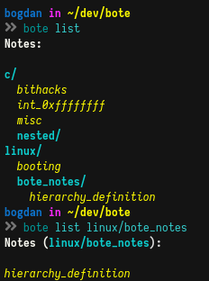

***bote*** is a notetaking and note management utility written in the [**fish shell**](https://fishshell.com/).

It implements functionality for editing, removing, moving, organizing, backuping up, and (re)arranging notes. 

--- 

## Dependencies

* **fish 3.0**
* **gnucoreutils**
* **pandoc**
* **wkhtmltopdf**
* **mupdf**
* **(n)vim** *(with the [Goyo](https://github.com/junegunn/goyo.vim) plugin)*

---

## The note storage system and its guidelines

* All of the notes are stored in a base "root" directory on the filesystem, hereinafter reffered to as the **"rootdir"**.
* All of the notes: 
    + are represented as regular files on the filesystem
    + are written in standard Markdown
    + always use the ***.md*** file extensions
* Notes may be nested (*categorized*) infinitely-deep inside of directories residing recursively inside the **"rootdir"**. Every directory recursively inside of the **"rootdir"** represents a **category**.
* Every *category* (a directory recursively inside of the **"rootdir"**) ***must*** inside of it contain a directory named ***"pdf"*** which represents a storepoint for any and all notes in the parent category (*directory*), even if the category contains no notes
* Any note **must** always be associated with an existing ".pdf" file inside of the child **"pdf"** directory and shouldn't exist without one.
* Any PDF file **must** always be associated with an existing ".md" file inside of the parent category (*directory*).
* Should any note be deleted by the user or the script, its associated PDF file must be deleted as well.
* Storepoints for formats other than PDF are permitted (*but none are currently implemented by the script*)

## Usage

For a comprehensive description of the utility and all of its functionality, see the manpage (**bote(1)**).

## Installation

1. Clone the repository
2. Copy the main executable to a location inside your `$PATH`, e.g. `$ cp ./bote /usr/local/bin`

---

**bote** comes with `Tab` interactive completions for fish. It's able to complete note/category names as well as all of the flags and their respective options.

1. Clone the repository
2. Run `$ cp completions/bote.fish ~/.config/fish/completions` to install the completions
3. Reload fish

## TODO

* ❌ Write the manpage and include usage examples
* ❌ Implement remote backup and restore functionality via Google Drive
* ❌ Implement the option for overriding the editor as well as the PDF reader (thus removing 2 potentially unnecessary dependencies)
* ✔️  ~~Implement interactive Tab completions~~
* ✔️ ~~Implement local backup and restore functionality~~
